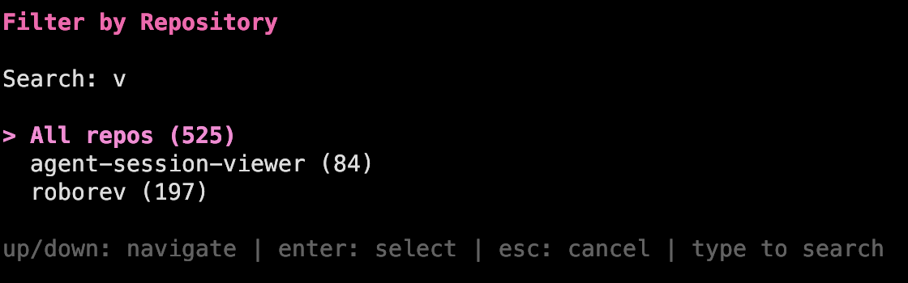
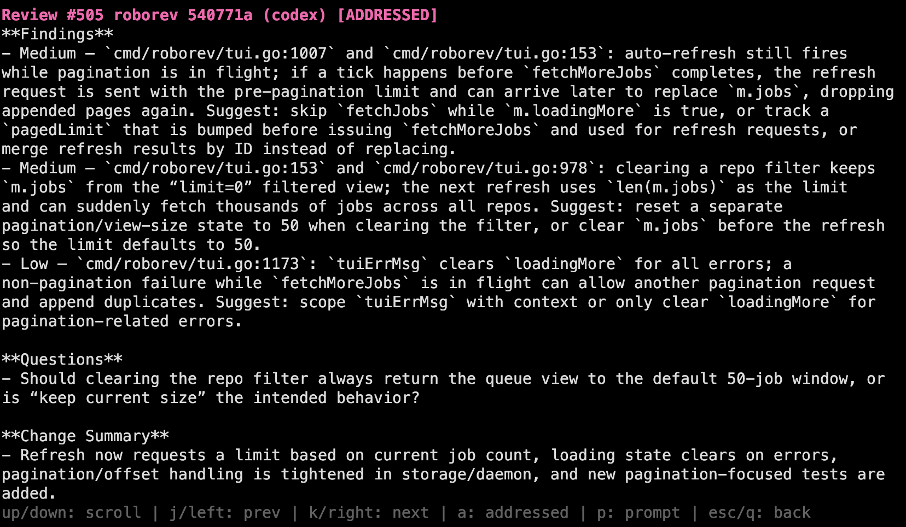

# roborev

Automatic code review for git commits using AI agents (Claude Code, Codex, Gemini, Copilot, OpenCode).


## Installation

```bash
curl -fsSL https://raw.githubusercontent.com/wesm/roborev/main/scripts/install.sh | bash
```

Or with Go:

```bash
go install github.com/wesm/roborev/cmd/roborev@latest
go install github.com/wesm/roborev/cmd/roborevd@latest
```

Ensure `$GOPATH/bin` is in your PATH:

```bash
export PATH="$PATH:$(go env GOPATH)/bin"
```

## Quick Start

```bash
cd your-repo
roborev init          # Install post-commit hook
git commit -m "..."   # Reviews happen automatically
roborev tui           # View reviews in interactive UI
```

**Note**: Hook installation automatically detects your git hook manager (Husky, etc.) via `core.hooksPath`.

## Commands

| Command | Description |
|---------|-------------|
| `roborev init` | Initialize roborev in current repo |
| `roborev status` | Show daemon and queue status |
| `roborev tui` | Interactive terminal UI |
| `roborev show [sha]` | Display review for commit |
| `roborev address <id>` | Mark review as addressed |
| `roborev enqueue <sha>` | Queue a commit for review |
| `roborev enqueue <start> <end>` | Queue a commit range (inclusive) |
| `roborev daemon start\|stop\|restart` | Manage the daemon |
| `roborev install-hook` | Install git post-commit hook |
| `roborev uninstall-hook` | Remove git post-commit hook |

## Configuration

### Per-Repository

Create `.roborev.toml` in your repo root:

```toml
agent = "claude-code"      # AI agent to use
review_context_count = 5   # Recent reviews to include as context

# Project-specific review guidelines
review_guidelines = """
No database migrations needed - no production databases yet.
Prefer composition over inheritance.
All public APIs must have documentation comments.
"""
```

### Global

Create `~/.roborev/config.toml`:

```toml
default_agent = "codex"
server_addr = "127.0.0.1:7373"
max_workers = 4
job_timeout = "10m"  # Per-job timeout (default: 10m)
```

Override the data directory with `ROBOREV_DATA_DIR`:

```bash
export ROBOREV_DATA_DIR=/custom/path  # Default: ~/.roborev
```

### Priority Order

1. `--agent` flag on command
2. Per-repo `.roborev.toml`
3. Global `~/.roborev/config.toml`
4. Auto-detect first available agent

### Review Guidelines

Use `review_guidelines` to give the AI reviewer project-specific context:

- Suppress irrelevant warnings ("no migrations needed yet")
- Enforce conventions ("use tabs not spaces")
- Add domain criteria ("check for PII exposure")

### Large Diffs

When a diff exceeds 250KB, roborev omits it from the prompt and provides only the commit hash. The AI agent can then inspect changes using its own tools (`git show <sha>`).

## Agents

| Agent | CLI Command | Install |
|-------|-------------|---------|
| `codex` | `codex` | `npm install -g @openai/codex` |
| `claude-code` | `claude` | `npm install -g @anthropic-ai/claude-code` |
| `gemini` | `gemini` | `npm install -g @google/gemini-cli` |
| `copilot` | `copilot` | `npm install -g @github/copilot` |
| `opencode` | `opencode` | `npm install -g opencode-ai` |

roborev auto-detects installed agents and falls back in order: codex → claude-code → gemini → copilot → opencode.

## TUI

The interactive terminal UI (`roborev tui`) provides a real-time view of the review queue.




**Queue View:**

| Key | Action |
|-----|--------|
| `↑`/`k`, `↓`/`j` | Navigate jobs |
| `PgUp`, `PgDn` | Page through list |
| `Enter` | View review |
| `p` | View prompt |
| `a` | Toggle addressed |
| `x` | Cancel running/queued job |
| `f` | Filter by repository |
| `Esc` | Clear filter |
| `q` | Quit |

**Review/Prompt View:**

| Key | Action |
|-----|--------|
| `↑`/`k`, `↓`/`j` | Scroll content |
| `←`/`h`, `→`/`l` | Previous/next review |
| `PgUp`, `PgDn` | Page through content |
| `a` | Toggle addressed |
| `p` | Switch between review/prompt |
| `Esc`, `q` | Back to queue |

## Architecture

roborev runs as a local daemon that processes review jobs in parallel:

```
~/.roborev/
├── config.toml    # Global configuration
├── daemon.json    # Runtime state (port, PID)
└── reviews.db     # SQLite database
```

The daemon starts automatically when needed and handles port conflicts gracefully.

## Development

```bash
git clone https://github.com/wesm/roborev
cd roborev
go test ./...
go install ./cmd/...
```

## License

MIT
